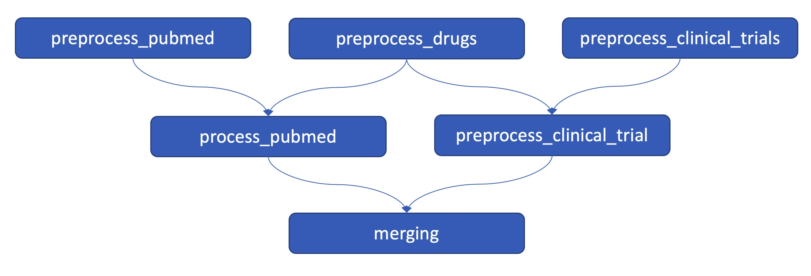

# Introduction

The objective of this project is to build a data pipeline that builds a connection graph between drugs and their mentions in scientific articles.

Here is what the data pipeline looks like:



It is composed of:

* 3 preprocessing steps: 1 for each data input
* 2 processing steps: one fore the clinical trials and one for the pubmed
* 1 output management step which consists of the merging of the results of the 2 processing steps

# Usage

To install the requirements, run:

```make install```

Then in order to initialize the docker-compose:

```make init_docker_compose```

And finally you can run:

```make run_dag```

to manually run the dag. You can also go to http://localhost:8080 and log in with airflow:airflow as credentials and manually run the dag.

# Next steps

* Implement all the tests (in a `tests` folder for example)
* Add the docstrings for all the functions
* Add a documentation with Sphinx for example
* Implement a CI/CD pipeline